# SkillSwap

## Project Overview
SkillSwap is a premium, modern web platform that connects mentors and learners, enabling users to swap skills, manage availability, and schedule sessions. The application features user authentication, a personalized dashboard, a dynamic skill marketplace with real-time filters, availability management, and session reviews.

---

## Features

- **User Management & Profile**: Secure registration, login/logout (supporting "Remember me" cookie persistence), profile details editing (name, bio, experience level), and profile photo uploads (JPEG/PNG/WebP, up to 2MB).
- **Skill Marketplace**:
  - Live search by keywords (matching skill names and descriptions).
  - Advanced filters including categories, mentor experience levels, skill proficiency, average rating, and real-time future availability.
- **Session Scheduling**:
  - Mentors can configure availability calendars (dates, start and end times).
  - Learners can view open slots and book sessions with custom notes.
  - Complete request lifecycle management: Accept, Reject, Cancel, and Complete.
- **Ratings & Reviews**: Submission of star ratings (1 to 5 stars) and review comments for completed sessions, with live updates to public profiles and marketplaces.
- **Personal Dashboard**: Widgets tracking active sessions, completed sessions, average rating, profile completion checklist, and upcoming sessions/reviews feeds.
- **Premium Responsive UI**: Sleek dark-mode aesthetic with custom glassmorphism components, gradients, and entrance micro-animations.

---

## Tech Stack

- **Frontend**: HTML5, Vanilla CSS3 (custom design system), JavaScript (ES6+)
- **Backend**: Core PHP (supporting MVC-like api endpoints, secure standard password hashing)
- **Database**: MySQL (transactional InnoDB engine with foreign keys)
- **Server**: Apache (via XAMPP)

---

## Installation & Setup

1. **Clone the Repository**:
   Extract or clone the project files to your local server directory, e.g., `c:/xampp/htdocs/SkillSwap`.

2. **Configure Database Configuration**:
   - Copy the example config file `backend/config/database.example.php` to `backend/config/database.php`.
   - Update connection constants in `backend/config/database.php` (default values are preconfigured for a standard local XAMPP setup).

3. **Import Database Schema**:
   - Create a MySQL database named **`skillswap`** (via phpMyAdmin or your MySQL CLI client).
   - Import the schema from **`database/skillswap.sql`** into the newly created `skillswap` database.

4. **Start Web Server**:
   - Open the XAMPP Control Panel and start **Apache** and **MySQL**.
   - Access the application in your browser at: **`http://localhost/SkillSwap`**.

See the detailed setup steps in [INSTALLATION.md](INSTALLATION.md).

---

## Screenshots

### Desktop Views

#### Landing Page
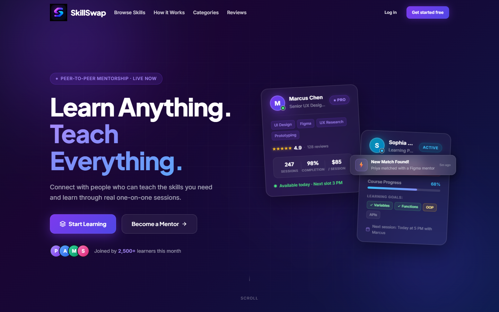

#### Dashboard
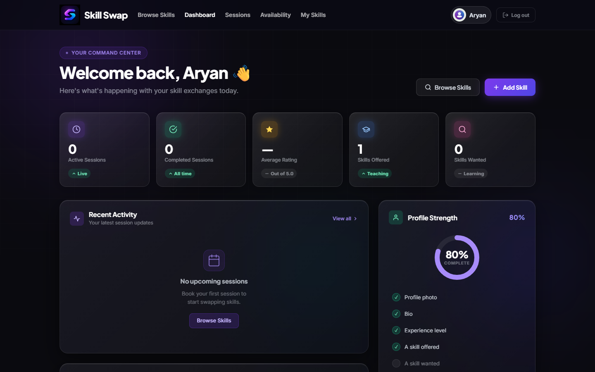

#### Browse Skills (Marketplace)
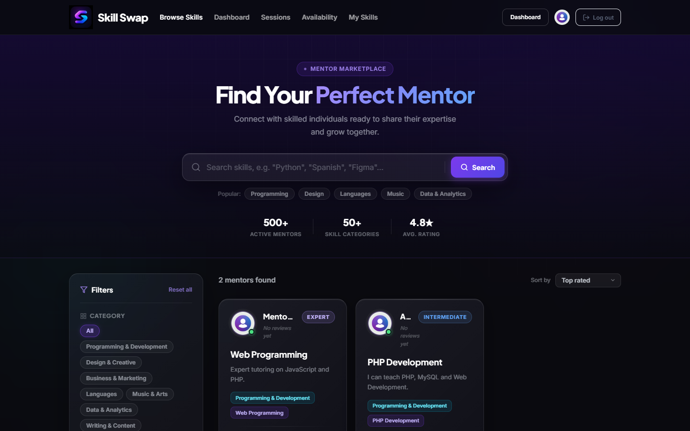

#### Skill Detail
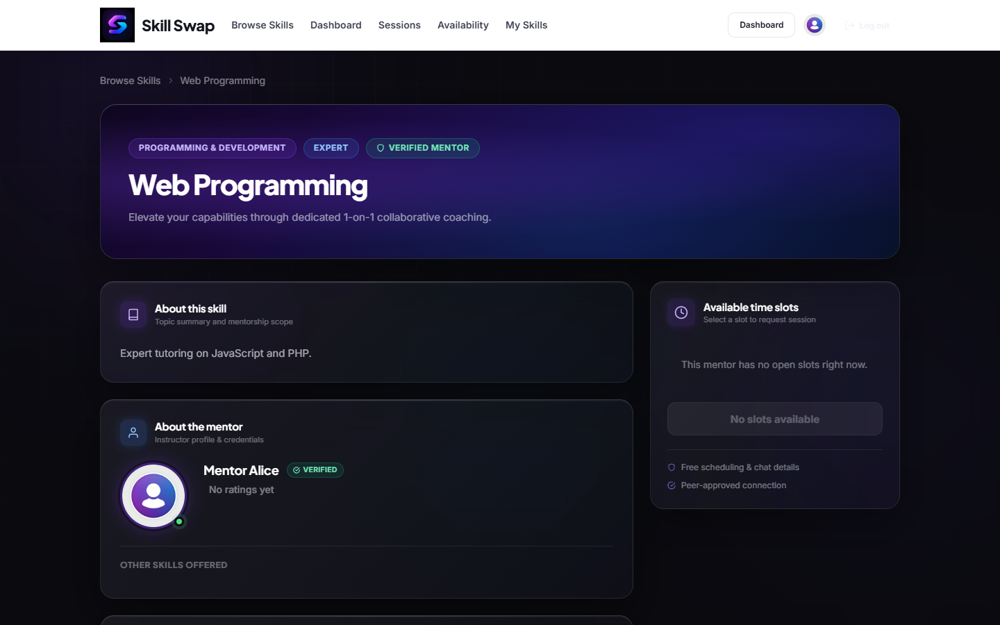

#### Availability Management
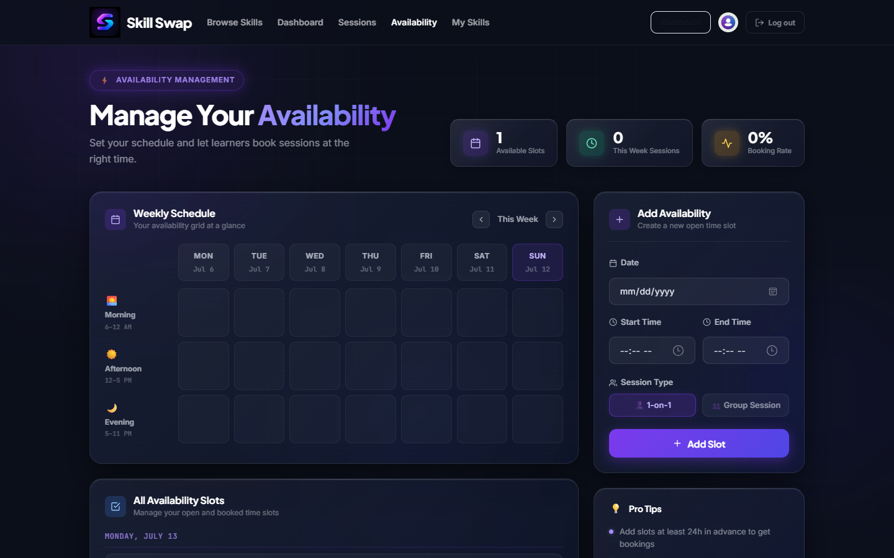

#### Upcoming Sessions
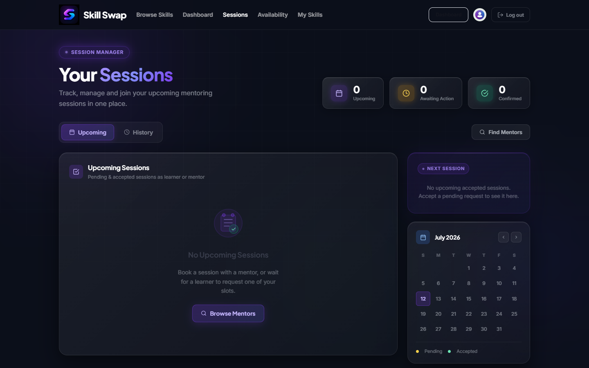

#### Profile Page
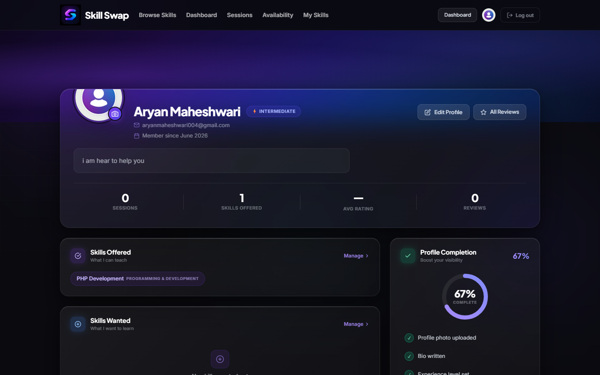

#### Reviews Page
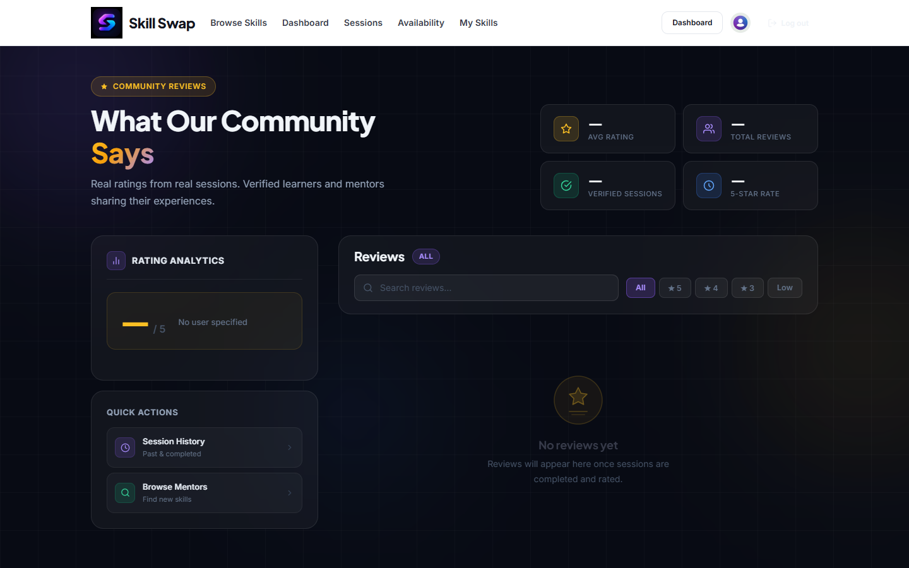

### Mobile Views

#### Mobile Landing Page
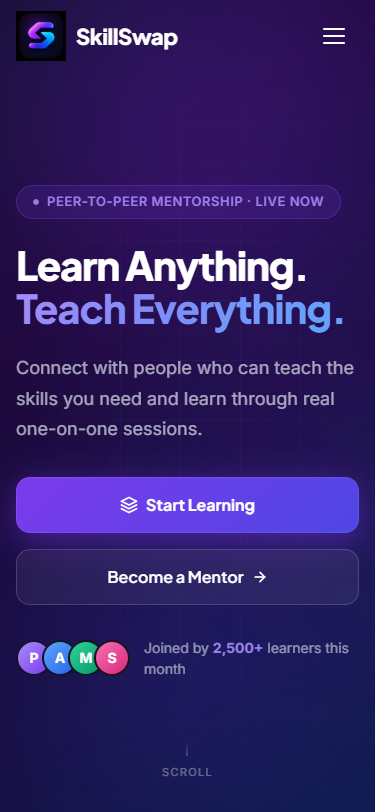

#### Mobile Dashboard
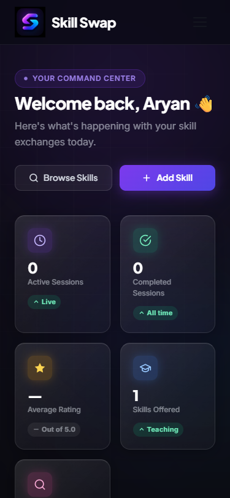

#### Mobile Browse Skills
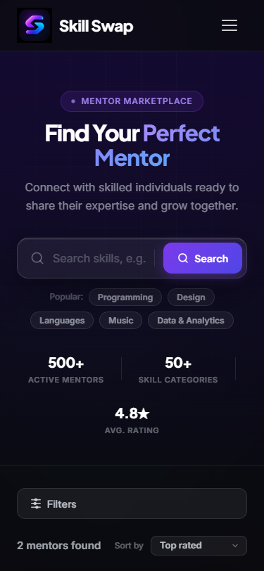

---

## Folder Structure

Below is the directory structure of the prepared project:

```text
SkillSwap/
├── assets/                    # Static UI resources
│   ├── css/                   # Stylesheets for base theme and responsive components
│   ├── images/                # Theme assets (logo, avatars) & screenshots/
│   │   ├── uploads/           # User profile picture upload destination
│   │   └── screenshots/       # Marketplace flow visual references
│   └── js/                    # Client-side routing, auth checking, and page controllers
├── backend/                   # Core PHP Backend
│   ├── api/                   # RESTful API endpoints for skill & session handling
│   ├── auth/                  # Login, registration, and logout handlers
│   ├── config/                # Database configurations & examples
│   └── includes/              # Shared authentication/response utilities
├── database/                  # Database migration schema
│   └── skillswap.sql          # Primary MySQL database schema
├── screenshots/               # High-res desktop & mobile screenshot assets
│   └── mobile/                # Mobile responsive screenshot assets
├── .gitignore                 # Excluded files for git version control
├── INSTALLATION.md            # Step-by-step developer environment setup instructions
├── README.md                  # Main project introduction & overview
├── index.html                 # App landing page
├── login.html                 # User authentication portal (sign in)
├── register.html              # User signup page
├── dashboard.html             # User administrative dashboard
├── availability.html          # Time scheduling slot calendar editor
├── book-session.html          # Learner-side booking reservation form
├── browse-skills.html         # Real-time searchable/filterable marketplace
├── my-skills.html             # Mentor-side skill listing controller
├── profile.html               # User details customization page
├── reviews.html               # Completed session peer review feed
├── session-history.html       # Completed/cancelled sessions history
├── skill-detail.html          # Skill info page & booking gateway
└── upcoming-sessions.html     # Active scheduling requests tracker
```

---

## Future Improvements

While SkillSwap is feature-complete, future updates will enhance scalable growth:
1. **Real-time Chat**: Integrated WebSocket server to allow direct mentor-learner real-time chatting on the platform.
2. **Notification Service**: Automated email and system notifications alert for new session requests, acceptances, and reviews.
3. **Payment Gateway Integration**: Built-in support for secure payment processing for paid skill swapping/tutoring sessions.
4. **Enhanced Analytics**: Deep learning dashboards for mentors to track earnings, teaching hours, and learner progress.
5. **Admin Portal**: A dedicated administrative dashboard for managing reported content, categories, and resolving disputes.

---

*Developed and maintained under SkillSwap core standards.*

